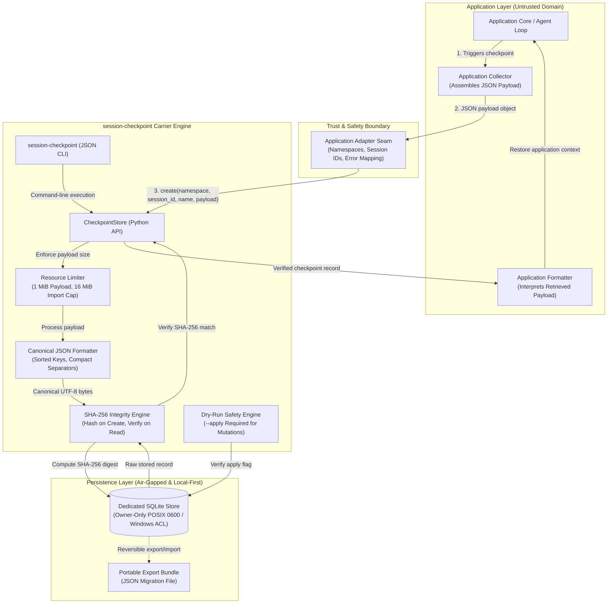
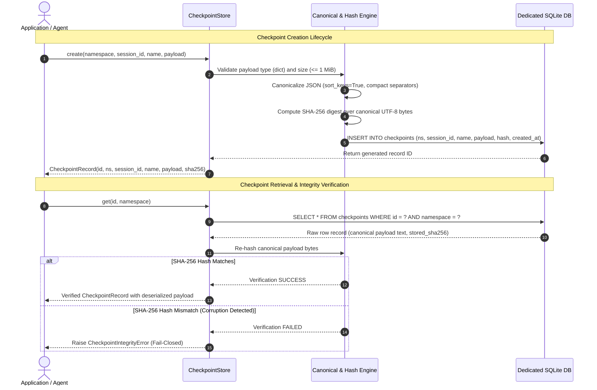

# session-checkpoint

<p align="center">
  <a href="NOTICE"></a>
  <a href="https://github.com/ellmos-ai/session-checkpoint/releases"></a>
  
  
  
  
  
  <a href="SECURITY.md"></a>
  <a href="THIRD_PARTY_LICENSES.md"></a>
  <a href="LICENSE"></a>
  <a href="https://github.com/ellmos-ai"></a>
  <a href="https://github.com/open-bricks"></a>
  <a href="llms.txt"></a>
</p>

**[English](README.md)** | **[Deutsch](README_de.md)**

> [!NOTE]
> **AI Agent & LLM Context:** `session-checkpoint` is architected for seamless inspection and operation by AI coding assistants (Claude Code, Gemini Antigravity, OpenAI Codex, Open-WebUI). Machine-readable system invariants, API contracts, and CLI commands are maintained in [`llms.txt`](llms.txt).

---

## Quick Navigation

- [<a href="#sec-01">§ 1 Overview & Core Philosophy</a>](#sec-01)
- [<a href="#sec-02">§ 2 Key Capabilities & Value Proposition</a>](#sec-02)
- [<a href="#sec-03">§ 3 Explicit Boundary & Non-Goals</a>](#sec-03)
- [<a href="#sec-04">§ 4 System Topology & Architecture</a>](#sec-04)
- [<a href="#sec-05">§ 5 Checkpoint Lifecycle & Verification Flow</a>](#sec-05)
- [<a href="#sec-06">§ 6 Target Personas & High-Intent SEO Queries</a>](#sec-06)
- [<a href="#sec-07">§ 7 10-Dimension Comparative Matrix vs. Alternatives</a>](#sec-07)
- [<a href="#sec-08">§ 8 Governance & 10 Runtime Invariants</a>](#sec-08)
- [<a href="#sec-09">§ 9 Python API Reference & Integration Patterns</a>](#sec-09)
- [<a href="#sec-10">§ 10 JSON CLI Reference & Subcommands</a>](#sec-10)
- [<a href="#sec-11">§ 11 Reversible Export, Import & Migration Bundles</a>](#sec-11)
- [<a href="#sec-12">§ 12 POSIX Permissions & Windows ACL Security</a>](#sec-12)
- [<a href="#sec-13">§ 13 Installation, Prerequisites & Getting Started</a>](#sec-13)
- [<a href="#sec-14">§ 14 Quality Assurance, Contract Tests & Test Suite</a>](#sec-14)
- [<a href="#sec-15">§ 15 Ecosystem, Umbrella & Sibling Projects</a>](#sec-15)
- [<a href="#sec-16">§ 16 Level 1 SBOM & Third-Party Licenses</a>](#sec-16)
- [<a href="#sec-17">§ 17 Machine-Readable LLM Context (llms.txt)</a>](#sec-17)
- [<a href="#sec-18">§ 18 Statutory Disclaimer (§ 521 BGB), Security SLA & License</a>](#sec-18)

---

<a id="sec-01"></a>
### § 1 Overview & Core Philosophy

In modern software development, autonomous AI agent pipelines, desktop applications, and CLI utilities require reliable state savepoints. However, existing persistence mechanisms frequently suffer from two opposing extremes:
1. **Ad-hoc Serialization Dumps (JSON / Pickle):** Fragile, prone to silent bit rot, devoid of transaction guarantees, vulnerable to arbitrary code execution, and lacking namespace isolation.
2. **Heavyweight Database Infrastructure / Cloud Backends:** Require background daemons, credential management, network egress risks, complex schema migrations, and external dependencies.

**`session-checkpoint` bridges this gap with an uncompromising carrier architecture:**
It acts as a local, application-neutral, embedded storage carrier powered exclusively by Python's built-in `sqlite3` driver. It treats checkpoint payloads as opaque, canonicalized JSON objects, computes cryptographic SHA-256 digests on creation, and enforces fail-closed integrity checks on every subsequent read.

[Back to Navigation](#quick-navigation)

---

<a id="sec-02"></a>
### § 2 Key Capabilities & Value Proposition

- **Zero External Dependencies:** Built entirely with Python 3.10+ standard library modules (`sqlite3`, `hashlib`, `json`, `pathlib`). No compilation step, no wheels, no vendor lock-in.
- **Cryptographic SHA-256 Integrity:** All stored JSON payloads are formatted canonically (sorted keys, compact separators, UTF-8 encoding). The hash is validated against the stored digest upon every retrieval.
- **Fail-Closed Protection:** Any data corruption, schema tampering, or storage error raises explicit exceptions (`CheckpointIntegrityError`) rather than returning contaminated state.
- **Namespace Segregation:** Multiple independent applications or modules can safely share a single checkpoint store or isolate dedicated files. Numeric IDs cannot collide across namespace boundaries.
- **Conservative Mutation (Dry-Run by Default):** Deletions and batch imports default to non-destructive simulation modes (`--dry-run`). Permanent writes require explicit `--apply` confirmations.
- **Strict Resource Caps:** Default limits defend local memory and disk against denial-of-service: 1 MiB per canonical payload (8 MiB pre-parse CLI cap); 1,000 checkpoints and 16 MiB aggregate payload per import bundle (32 MiB pre-parse CLI cap).
- **Dual Interface:** Full parity between a native Python API (`CheckpointStore`) and a structured JSON-only CLI suitable for shell scripting and process automation.

[Back to Navigation](#quick-navigation)

---

<a id="sec-03"></a>
### § 3 Explicit Boundary & Non-Goals

`session-checkpoint` is deliberately designed as a **carrier**, not an application manager:

> [!IMPORTANT]
> **What the Carrier Deliberately Does NOT Do:**
> - It does **not** inspect or interpret application tables or domain semantics.
> - It does **not** collect tasks, orchestrate agent memory, or monitor processes.
> - It does **not** automatically apply or restore application state upon retrieval.
> - It does **not** synchronize databases across machines or make network calls.
> - It does **not** provide cryptographic signatures or authentication (payload hashes detect local bit corruption, not domain authenticity).

An application adapter retains complete ownership of:
1. Assembling domain state into a clean JSON object payload.
2. Selecting namespace, session identifier, checkpoint kind, and descriptive name.
3. Interpreting retrieved payloads and restoring internal memory structures.

[Back to Navigation](#quick-navigation)

---

<a id="sec-04"></a>
### § 4 System Topology & Architecture

The following diagram illustrates the boundary between the calling application, the adapter seam, the `session-checkpoint` engine, and the local SQLite storage:



[Back to Navigation](#quick-navigation)

---

<a id="sec-05"></a>
### § 5 Checkpoint Lifecycle & Verification Flow

The end-to-end lifecycle for creating and retrieving an integrity-verified checkpoint follows strict sequential steps:



[Back to Navigation](#quick-navigation)

---

<a id="sec-06"></a>
### § 6 Target Personas & High-Intent SEO Queries

`session-checkpoint` addresses four specialized engineering personas requiring deterministic local state management:

- **`[PERSONA-01]` Local AI Agent & Assistant Engineers:** Developers building autonomous coding agents (Claude Code, Gemini Antigravity, OpenAI Codex, Open-WebUI agents) requiring reliable local session savepoints, compaction checkpoints, and rollback snapshots between tool invocations without leaking private context to the network.
- **`[PERSONA-02]` Desktop & GUI Application Developers:** PySide6, PyQt, Tkinter, and Electron software engineers needing robust, lightweight session state preservation across restarts and unexpected application crashes without building custom database schemas.
- **`[PERSONA-03]` CLI Tool & Pipeline Automation Authors:** Authors of multi-stage ETL scripts, batch processors, and CLI tools requiring structured checkpoint history, repeatable dry-run deletion, and portable JSON migration bundles.
- **`[PERSONA-04]` Security & Compliance-Conscious Teams:** Organizations requiring air-gapped, zero-telemetry developer infrastructure that guarantees tamper detection, owner-only file permissions, and strictly bounded memory allocations.

#### High-Intent SEO Queries:
- `python session checkpoint library sqlite`
- `local first session persistence sha256`
- `zero dependency json checkpoint storage python`
- `ai agent state checkpointing sqlite`
- `fail closed session store integrity verification`
- `application neutral session state carrier`

[Back to Navigation](#quick-navigation)

---

<a id="sec-07"></a>
### § 7 10-Dimension Comparative Matrix vs. Alternatives

| Feature / Dimension | `session-checkpoint` | Full SQLite DB Backup | Ad-Hoc DB Tables | Raw JSON Files | Cloud KV Stores (Redis/S3) |
|:---|:---:|:---:|:---:|:---:|:---:|
| **Zero External Dependencies** | **YES (stdlib only)** | YES | YES | YES | NO (requires clients) |
| **Cryptographic Hash on Read** | **YES (SHA-256)** | NO | NO | NO | NO |
| **Fail-Closed Tamper Guard** | **YES** | NO | NO | NO | NO |
| **Application Neutrality** | **YES (Carrier)** | NO (full schema) | NO (tight coupling) | Partial | Partial |
| **Strict Namespace Isolation** | **YES (Mandatory)** | NO | Manual | Manual | Keyspace prefixes |
| **Dry-Run Mutation Safety** | **YES (Default)** | NO | NO | NO | NO |
| **Enforced Size & Record Caps** | **YES (Bounded)** | NO | NO | NO | Cloud quota dependent |
| **Reversible Portable Export** | **YES (Atomic JSON)** | NO (.db copy) | Custom scripts | Manual | Custom dumps |
| **Zero Network Egress (Local)** | **YES (Air-Gapped)** | YES | YES | YES | NO (Network required) |
| **User-Mode Execution (RunAsInvoker)** | **YES** | YES | YES | YES | Cloud auth required |

[Back to Navigation](#quick-navigation)

---

<a id="sec-08"></a>
### § 8 Governance & 10 Runtime Invariants

The `session-checkpoint` architecture is governed by ten formal invariants:

- `INV-LOCAL-01`: **100% Local-First Storage (Zero Egress):** Operates strictly offline on a dedicated local SQLite database file. Zero external network calls, zero telemetry, air-gapped safe.
- `INV-CANON-02`: **Deterministic Canonical JSON Hashing:** Payloads are formatted canonically (keys sorted alphabetically, compact separators `","` and `":"`, UTF-8 encoded) with SHA-256 cryptographic digest computed upon creation and verified upon every read.
- `INV-FAILCLOSE-03`: **Fail-Closed Cryptographic Verification:** Any bitflip, disk corruption, unauthorized SQLite row alteration, or schema drift immediately raises `CheckpointIntegrityError` upon `get()` or `list()`. Corrupted payloads are never returned.
- `INV-BOUNDARY-04`: **Application Boundary Isolation:** The carrier does not inspect application schemas, does not collect application memory or tasks, and does not perform application restoration. Separation of concerns is absolute.
- `INV-NAMESP-05`: **Strict Namespace Segregation:** All operations require an explicit `namespace` parameter. Numeric primary keys cannot cross application boundaries. Foreign rows cannot be accessed or deleted by ID alone.
- `INV-LIMITS-06`: **Enforced Resource Caps:** Default limits prevent denial-of-service / memory exhaustion: 1 MiB max canonical payload (8 MiB CLI pre-parse input limit); 1,000 checkpoints and 16 MiB aggregate payload per import bundle (32 MiB CLI import input limit).
- `INV-DRYRUN-07`: **Conservative Mutation (Dry-Run by Default):** Destructive and bulk operations (`delete`, `import`) default to dry-run planning mode. Permanent alterations require explicit `--apply` flags in CLI or `apply=True` parameter in Python.
- `INV-PERM-08`: **POSIX Least-Privilege & Windows ACL Hygiene:** Newly created store and export files on POSIX systems enforce owner-only `0600` permission bits; existing stores are re-hardened upon schema validation. Windows systems document explicit directory ACL isolation.
- `INV-REVERSIBLE-09`: **Reversible Portable Migration Bundles:** Checkpoint export and import preserve numeric IDs, creation timestamps, and SHA-256 digests, enabling byte-for-byte migration validation and rollback comparison across local environments.
- `INV-SLA-10`: **RunAsInvoker & 48h Security Response SLA:** Executes entirely in unprivileged user space (`RunAsInvoker`, zero elevation). Security inquiries follow a strict 48-hour response acknowledgment and 5 business days triage target.

[Back to Navigation](#quick-navigation)

---

<a id="sec-09"></a>
### § 9 Python API Reference & Integration Patterns

The core API is provided by the `CheckpointStore` class:

```python
from session_checkpoint import CheckpointStore, CheckpointIntegrityError

# 1. Initialize store (creates table checkpoint_meta & checkpoints if absent)
store = CheckpointStore("local-checkpoints.sqlite")

# 2. Create an immutable checkpoint
record = store.create(
    namespace="agent-workspace",
    session_id="session-2026-09-22",
    name="pre-tool-execution",
    payload={"active_files": ["main.py"], "step": 14, "context_tokens": 8420},
    kind="auto",
    source_ref="step-14",
)
print(f"Created checkpoint ID {record.id} with SHA-256: {record.payload_sha256}")

# 3. Retrieve and cryptographically verify
try:
    checkpoint = store.get(record.id, namespace="agent-workspace")
    print(f"Loaded payload: {checkpoint.payload}")
except CheckpointIntegrityError as exc:
    print(f"Payload corrupted on disk! Refusing to load: {exc}")

# 4. List checkpoints for a specific session
records = store.list(namespace="agent-workspace", session_id="session-2026-09-22")
print(f"Found {len(records)} checkpoints")

# 5. Delete with dry-run protection
planned_deletion = store.delete(record.id, namespace="agent-workspace", apply=False)
print(f"Planned deletion for {planned_deletion['name']} (rows affected: 0)")

# Execute actual deletion
store.delete(record.id, namespace="agent-workspace", apply=True)
```

[Back to Navigation](#quick-navigation)

---

<a id="sec-10"></a>
### § 10 JSON CLI Reference & Subcommands

The package provides a JSON-only CLI entry point `session-checkpoint` for shell automation and subprocess integration:

```bash
# Create a checkpoint from a JSON file
session-checkpoint create \
  --store local-checkpoints.sqlite \
  --namespace example-app \
  --session-id session-001 \
  --name before-upgrade \
  --payload-file payload.json

# Dry-run checkpoint creation check (validates JSON without writing to store)
session-checkpoint create \
  --store local-checkpoints.sqlite \
  --namespace example-app \
  --session-id session-001 \
  --name test \
  --payload-file payload.json \
  --dry-run

# List checkpoints in a namespace
session-checkpoint list --store local-checkpoints.sqlite --namespace example-app

# Get a specific checkpoint by ID
session-checkpoint get --store local-checkpoints.sqlite --namespace example-app --id 1

# Plan deletion (dry-run by default)
session-checkpoint delete --store local-checkpoints.sqlite --namespace example-app --id 1

# Execute deletion with explicit confirmation
session-checkpoint delete --store local-checkpoints.sqlite --namespace example-app --id 1 --apply
```

> [!TIP]
> **Deterministic JSON Output:** All CLI commands output valid JSON objects to `stdout`. On errors, the CLI exits with code `1` and emits a structured error dictionary: `{"error": "...", "type": "..."}`.

[Back to Navigation](#quick-navigation)

---

<a id="sec-11"></a>
### § 11 Reversible Export, Import & Migration Bundles

`session-checkpoint` includes built-in migration carriers for exporting and importing checkpoint bundles across environments:

```bash
# Export all checkpoints from a namespace into an atomic JSON bundle
session-checkpoint export \
  --store local-checkpoints.sqlite \
  --namespace example-app \
  --output export.json

# Dry-run import verification (validates format, limits, and hash integrity)
session-checkpoint import \
  --store target-store.sqlite \
  --namespace example-app \
  --input export.json

# Execute import
session-checkpoint import \
  --store target-store.sqlite \
  --namespace example-app \
  --input export.json \
  --apply
```

#### Import Validation Rules:
1. **Idempotence:** Re-importing identical records (matching ID, payload hash, and source reference) is an idempotent no-op.
2. **Fail-Closed on Conflict:** Any collision where an existing record shares an ID or `source_ref` with differing payload hashes aborts immediately before modifying any row.
3. **Resource Guardrails:** Default import limits enforce maximum 1,000 checkpoints and 16 MiB aggregate canonical payload size.

[Back to Navigation](#quick-navigation)

---

<a id="sec-12"></a>
### § 12 POSIX Permissions & Windows ACL Security

Checkpoint files contain sensitive local state and require proper filesystem protection:

- **POSIX Systems:** Newly created SQLite databases and JSON export files are automatically initialized with owner-only permissions (`0600` mode bits). Compatible existing stores are validated against schema invariants and re-hardened on connection.
- **Windows Systems:** Windows file permissions are determined by the parent directory's Access Control List (ACL). Place checkpoint stores in private user directories (e.g. `%LOCALAPPDATA%` or a dedicated profile folder) where inheritance prevents access from other local users.

[Back to Navigation](#quick-navigation)

---

<a id="sec-13"></a>
### § 13 Installation, Prerequisites & Getting Started

`session-checkpoint` requires **Python 3.10** or higher.

```bash
# Clone the repository
git clone https://github.com/ellmos-ai/session-checkpoint.git
cd session-checkpoint

# Install in editable mode with development dependencies
python -m pip install -e ".[dev]"

# Run regression test suite
python -m pytest -ra -q
```

[Back to Navigation](#quick-navigation)

---

<a id="sec-14"></a>
### § 14 Quality Assurance, Contract Tests & Test Suite

The repository includes a comprehensive automated test suite verifying functional persistence, CLI subcommands, integrity error triggers, resource limits, and metadata contracts:

- **Functional Persistence Tests:** Verify SQLite table creation, row insertion, canonical hashing, and dry-run deletion.
- **Integrity Mutation Tests:** Simulate bitflips directly in SQLite database columns to ensure `CheckpointIntegrityError` fires reliably.
- **Resource Boundary Tests:** Validate rejection of payloads exceeding 1 MiB and import bundles exceeding 16 MiB.
- **Contract Metadata Tests (`tests/test_metadata.py`):** Verify PEP 621 metadata, version synchronicity across manifests, 0 unpinned CI actions, zero host/path leaks, and bilingual documentation parity.

**Test Execution:**
```bash
python -m pytest tests/ -v
# Result: 36 passed, 1 skipped (POSIX mode test skipped on Windows)
```

[Back to Navigation](#quick-navigation)

---

<a id="sec-15"></a>
### § 15 Ecosystem, Umbrella & Sibling Projects

`session-checkpoint` is part of the **ellmos-ai** intelligent infrastructure portfolio and the **open-bricks** software umbrella:

- **[ellmos-ai](https://github.com/ellmos-ai):** Core runtime components, intelligent agent architectures, and local-first developer infrastructure.
- **[open-bricks](https://github.com/open-bricks):** Umbrella organization promoting modular, self-contained, air-gapped desktop and developer tools.
- **Sibling Modules:**
  - `ellmos-ai/stacks`: Modular orchestration and stack definitions.
  - `dev-bricks/safe-start-for-codex`: Local safety gating and supervisor for desktop agent automations.
  - `doc-bricks/UniversalMailCleaner`: Local-first desktop mail hygiene tool with strict privacy boundaries.

[Back to Navigation](#quick-navigation)

---

<a id="sec-16"></a>
### § 16 Level 1 SBOM & Third-Party Licenses

`session-checkpoint` enforces 100% license transparency. The core library has **zero external runtime dependencies**, relying solely on the Python Software Foundation License (`PSF-2.0`).

- Full Software Bill of Materials (SBOM) and development tooling licenses are detailed in [`THIRD_PARTY_LICENSES.md`](THIRD_PARTY_LICENSES.md).
- Attribution and statutory terms are documented in [`NOTICE`](NOTICE).
- The project is distributed under the permissive **MIT License**.

[Back to Navigation](#quick-navigation)

---

<a id="sec-17"></a>
### § 17 Machine-Readable LLM Context (llms.txt)

To empower AI coding assistants (Claude Code, Gemini Antigravity, OpenAI Codex, Kimi) to interact with `session-checkpoint` with high precision, the repository maintains an authoritative [`llms.txt`](llms.txt) file at the project root. It provides:
- Machine-readable system invariants and trust boundaries.
- Full CLI command-line argument specifications.
- Python API signatures and type constraints.
- Recommended discoverability queries and ecosystem mapping.

[Back to Navigation](#quick-navigation)

---

<a id="sec-18"></a>
### § 18 Statutory Disclaimer (§ 521 BGB), Security SLA & License

#### Statutory Disclaimer (§ 521 BGB)
This software is provided free of charge as open-source software (unentgeltliche Bereitstellung / Schenkung gem. §§ 516 ff. BGB). Under German law (§ 521 BGB) and the terms of the MIT License, liability is limited to intent (Vorsatz) and gross negligence (grobe Fahrlässigkeit).

#### Security Response SLA
We take security vulnerabilities seriously. Reports submitted via maintainer channels receive:
- **Initial Response:** Within **48 hours**.
- **Triage & Mitigation Target:** Within **5 business days**.
- **Execution Privileges:** Strictly unprivileged user-mode (`RunAsInvoker`).

#### License
Version 0.1.1 is published under the MIT licence. See `LICENSE`, `NOTICE`, `STATE.md`, and `ARCHITECTURE.md`.
