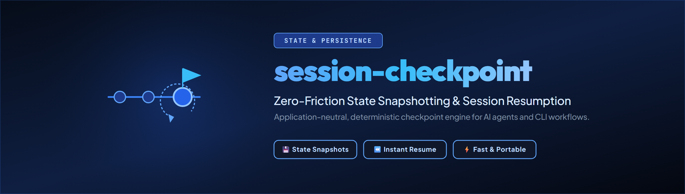

# session-checkpoint

Lokaler, anwendungsneutraler Speicher für Session-Checkpoints mit Python-API und JSON-CLI.

*[English](README.md)*

> **Privater Aufbau.** Dieser Träger schließt die Session-Checkpoint-Lücke aus open-oceans K9-
> Roadmap. Er bleibt privat und unveröffentlicht, solange Integration und Freigabe offen sind.

## Was das Modul leistet

- Es speichert von einer Anwendung gelieferte Checkpoint-Nutzlasten in einer eigenen lokalen
  SQLite-Datei.
- Es bietet Erstellen, Laden, Auflisten und konservative Löschung über Python und eine reine
  JSON-CLI.
- JSON-Objekte werden kanonisch gespeichert und bei jedem Lesen über SHA-256 geprüft.
- Namensräume trennen Anwendungen; Quellreferenzen verhindern doppelte Migrationszeilen.
- Export und Import unterstützen spätere Migrations- und Rückwegtests.
- Importe sind standardmäßig auf 1.000 Checkpoints, 16 MiB kanonische Gesamtnutzlast und bei der
  CLI auf eine 32 MiB große Eingabedatei begrenzt; Python-Aufrufer können strengere Grenzen setzen.
- Nutzlastdateien für `create` werden oberhalb von 8 MiB bereits vor dem JSON-Parsing abgelehnt;
  die kanonische Nutzlast bleibt standardmäßig auf 1 MiB begrenzt.

## Was das Modul bewusst nicht leistet

Der Träger liest keine Anwendungstabellen, sammelt nicht selbst Aufgaben oder Gedächtnisinhalte,
stellt keinen Anwendungszustand wieder her, synchronisiert keine Datenbanken und nutzt kein
Netzwerk. Eine dünne Anwendungsintegration stellt die Nutzlast zusammen und formatiert sie nach
dem Laden. Gleich klingende Begriffe machen einen Datenbank-Snapshot nicht zu einem
Session-Checkpoint.

## Installation für die Entwicklung

```shell
python -m pip install -e ".[dev]"
python -m pytest -q
```

## Python-API

```python
from session_checkpoint import CheckpointStore

store = CheckpointStore("local-checkpoints.sqlite")
created = store.create(
    namespace="example-app",
    session_id="session-001",
    name="before-upgrade",
    payload={"open_items": [{"id": 1, "title": "Synthetic item"}]},
)
loaded = store.get(created.id, namespace="example-app")
```

Die Nutzlast muss ein JSON-Objekt sein. Die Anwendung bestimmt dessen Inhalt und Bedeutung.

## JSON-CLI

```shell
session-checkpoint create \
  --store local-checkpoints.sqlite \
  --namespace example-app \
  --session-id session-001 \
  --name before-upgrade \
  --payload-file payload.json

session-checkpoint list --store local-checkpoints.sqlite --namespace example-app
session-checkpoint get --store local-checkpoints.sqlite --namespace example-app --id 1

# Deletion is only planned by default.
session-checkpoint delete --store local-checkpoints.sqlite --namespace example-app --id 1
session-checkpoint delete --store local-checkpoints.sqlite --namespace example-app --id 1 --apply
```

Erwartete CLI-Fehler liefern Exit-Code 1 und ein JSON-Objekt auf stdout. Ein Export enthält
Anwendungsdaten und muss deshalb wie eine sensible lokale Datei behandelt werden. Unter POSIX
werden neue Stores und Exporte mit Rechten ausschließlich für den Eigentümer angelegt; passende
bestehende Stores werden beim Öffnen nachgehärtet. Unter Windows müssen sie in einem Verzeichnis
liegen, dessen ACL nur dem vorgesehenen Konto Zugriff gewährt, weil Python-Dateimodi keine
Windows-ACL konfigurieren.

## Stand und Freigabe

Version 0.1.0 ist ein privater Integrationsstand. Maßgeblich sind `STATE.md`, `ARCHITECTURE.md`
und `PRIVATE.txt`. Der User hat am 22.08.2026 die MIT-Lizenz gewählt; das Repository bleibt
privat, und eine öffentliche Paketfreigabe wurde nicht erteilt.

---
<!-- REMEMBER: ENDUSERTEXTE BEKOMMEN ECHTE UMLAUTE Ü Ö Ä -->
