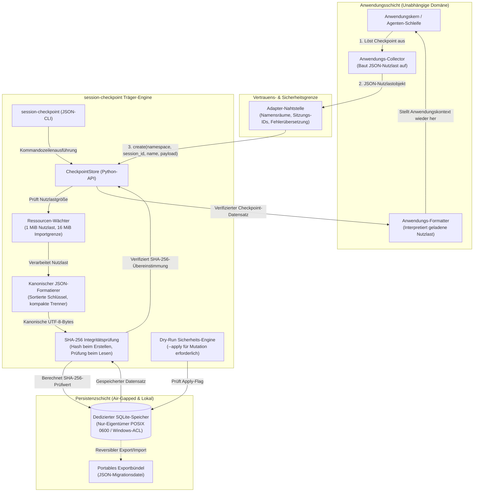
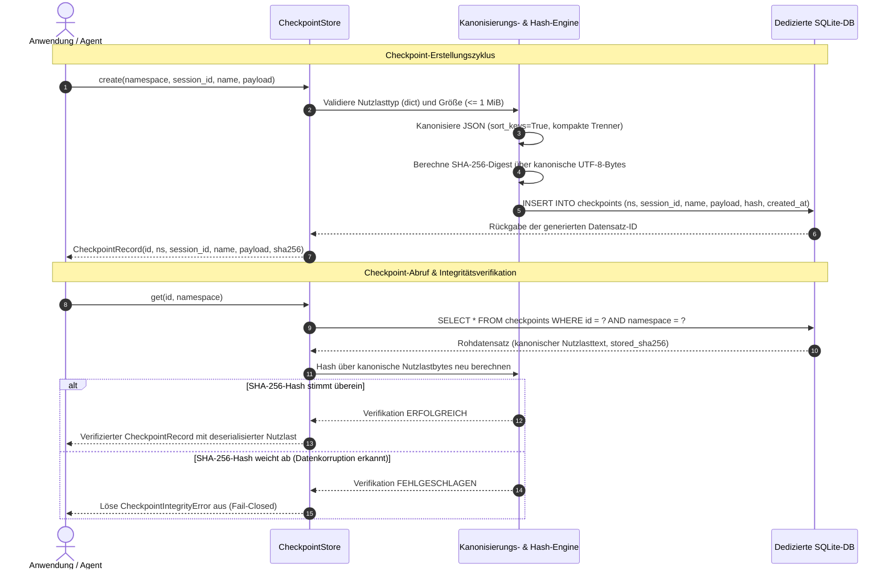

# session-checkpoint

<p align="center">
  <a href="NOTICE"></a>
  <a href="https://github.com/ellmos-ai/session-checkpoint/releases"></a>
  
  
  
  
  
  <a href="SECURITY.md"></a>
  <a href="THIRD_PARTY_LICENSES.md"></a>
  <a href="LICENSE"></a>
  <a href="https://github.com/ellmos-ai"></a>
  <a href="https://github.com/open-bricks"></a>
  <a href="llms.txt"></a>
</p>

**[English](README.md)** | **[Deutsch](README_de.md)**

> [!NOTE]
> **KI-Agenten & LLM-Kontext:** `session-checkpoint` wurde für die direkte Inspektion und Ausführung durch lokale KI-Programmierassistenten (Claude Code, Gemini Antigravity, OpenAI Codex, Open-WebUI) konzipiert. Maschinenlesbare Systeminvarianten, API-Verträge und CLI-Befehle sind in [`llms.txt`](llms.txt) hinterlegt.

---

## Schnelle Navigation

- [<a href="#sec-01">§ 1 Überblick & Kernphilosophie</a>](#sec-01)
- [<a href="#sec-02">§ 2 Kernfunktionen & Nutzenversprechen</a>](#sec-02)
- [<a href="#sec-03">§ 3 Bewusste Systemgrenzen & Nicht-Ziele</a>](#sec-03)
- [<a href="#sec-04">§ 4 Systemtopologie & Architektur</a>](#sec-04)
- [<a href="#sec-05">§ 5 Checkpoint-Lebenszyklus & Verifikationsablauf</a>](#sec-05)
- [<a href="#sec-06">§ 6 Zielgruppen & Suchbegriffe (SEO)</a>](#sec-06)
- [<a href="#sec-07">§ 7 10-Dimensionen-Vergleichsmatrix vs. Alternativen</a>](#sec-07)
- [<a href="#sec-08">§ 8 Governance & 10 Laufzeit-Invarianten</a>](#sec-08)
- [<a href="#sec-09">§ 9 Python-API-Referenz & Integrationsmuster</a>](#sec-09)
- [<a href="#sec-10">§ 10 JSON-CLI-Referenz & Unterbefehle</a>](#sec-10)
- [<a href="#sec-11">§ 11 Reversibler Export, Import & Migrationsbündel</a>](#sec-11)
- [<a href="#sec-12">§ 12 POSIX-Berechtigungen & Windows-ACL-Sicherheit</a>](#sec-12)
- [<a href="#sec-13">§ 13 Installation, Voraussetzungen & Erste Schritte</a>](#sec-13)
- [<a href="#sec-14">§ 14 Qualitätssicherung, Vertragstests & Testsuite</a>](#sec-14)
- [<a href="#sec-15">§ 15 Ökosystem, Dachorganisation & Schwesterprojekte</a>](#sec-15)
- [<a href="#sec-16">§ 16 Level 1 SBOM & Lizenzen von Drittanbietern</a>](#sec-16)
- [<a href="#sec-17">§ 17 Maschinenlesbarer LLM-Kontext (llms.txt)</a>](#sec-17)
- [<a href="#sec-18">§ 18 Gesetzlicher Haftungshinweis (§ 521 BGB), Sicherheits-SLA & Lizenz</a>](#sec-18)

---

<a id="sec-01"></a>
### § 1 Überblick & Kernphilosophie

In der modernen Softwareentwicklung benötigen autonome KI-Agenten-Pipelines, Desktop-Applikationen und CLI-Werkzeuge verlässliche Sicherungspunkte für Sitzungszustände. Herkömmliche Persistenzansätze leiden jedoch häufig unter zwei gegensätzlichen Extremen:
1. **Ad-hoc-Dateidumps (JSON / Pickle):** Fragil, anfällig für unbemerkte Datenkorruption, ohne Transaktionsgarantien, risikobehaftet bei Deserialisierung und ohne saubere Namensraumtrennung.
2. **Schwergewichtige Datenbanksysteme / Cloud-Backends:** Erfordern Hintergrunddienste, Zugangsdatenverwaltung, bergen Risiken von Netzwerklecks, verlangen komplexe Schemamigrationen und bringen externe Abhängigkeiten mit.

**`session-checkpoint` schließt diese Lücke durch eine kompromisslose Trägerarchitektur:**
Es fungiert als lokaler, anwendungsneutraler, eingebetteter Speicherträger, der ausschließlich auf dem in Python integrierten `sqlite3`-Treiber aufbaut. Checkpoint-Nutzlasten werden als opake, kanonische JSON-Objekte gespeichert, beim Erstellen mit einem kryptografischen SHA-256-Hash versehen und bei jedem späteren Lesevorgang strikt fail-closed auf Integrität geprüft.

[Zurück zur Navigation](#schnelle-navigation)

---

<a id="sec-02"></a>
### § 2 Kernfunktionen & Nutzenversprechen

- **Null externe Abhängigkeiten:** Vollständig mit der Python 3.10+ Standardbibliothek implementiert (`sqlite3`, `hashlib`, `json`, `pathlib`). Keine Kompilierung, keine C-Extensions, kein Vendor-Lock-in.
- **Kryptografische SHA-256-Integrität:** Alle gespeicherten JSON-Nutzlasten werden kanonisch formatiert (sortierte Schlüssel, kompakte Trennzeichen, UTF-8-Codierung). Bei jedem Abruf wird der Hash gegen den gespeicherten Prüfwert verifiziert.
- **Fail-Closed-Sicherheit:** Datenkorruption, Schemamanipulation oder Speicherfehler lösen explizite Ausnahmen (`CheckpointIntegrityError`) aus, anstatt beschädigte Zustände an den Aufrufer zurückzugeben.
- **Strikte Namensraumtrennung:** Mehrere unabhängige Anwendungen oder Module können sicher dieselbe Checkpoint-Datei teilen oder eigene Dateien nutzen. Numerische IDs kollidieren nicht über Namensraumgrenzen hinweg.
- **Konservative Mutationen (Dry-Run als Standard):** Löschung und Batch-Importe laufen standardmäßig im simulationsbasierten Planungsmodus (`--dry-run`). Echte Schreiboperationen erfordern eine explizite `--apply`-Bestätigung.
- **Feste Ressourcenobergrenzen:** Standardgrenzen schützen Hauptspeicher und Dateisystem vor Überlastung: 1 MiB pro kanonischer Nutzlast (8 MiB CLI-Dateilimit vor dem Parsen); 1.000 Checkpoints und 16 MiB Gesamtnutzlast pro Importbündel (32 MiB CLI-Dateilimit).
- **Duale Schnittstelle:** Volle funktionale Parität zwischen nativer Python-API (`CheckpointStore`) und einer strukturierten reinen JSON-CLI für Skripte und Shell-Automationen.

[Zurück zur Navigation](#schnelle-navigation)

---

<a id="sec-03"></a>
### § 3 Bewusste Systemgrenzen & Nicht-Ziele

`session-checkpoint` ist bewusst als **Speicherträger** und nicht als Anwendungsmanager konzipiert:

> [!IMPORTANT]
> **Was das Modul bewusst NICHT leistet:**
> - Es liest und interpretiert **keine** anwendungsspezifischen Tabellen oder Fachlogiken.
> - Es sammelt **keine** Aufgaben, orchestriert kein Agentengedächtnis und überwacht keine Prozesse.
> - Es stellt beim Abruf **keinen** Anwendungszustand automatisch im Speicher wieder her.
> - Es synchronisiert **keine** Datenbanken über Netzwerke und sendet keinerlei Daten ins Internet.
> - Es erzeugt **keine** digitalen Signaturen zur Echtheitsbeglaubigung (Payload-Hashes dienen der lokalen Bitfehlererkennung, nicht der Authentifizierung).

Ein Anwendungsadapter behält die vollständige Kontrolle über:
1. Das Zusammenstellen des Anwendungszustands als sauberes JSON-Objekt.
2. Die Wahl von Namensraum, Sitzungs-ID, Checkpoint-Typ und sprechendem Namen.
3. Die Interpretation geladener Nutzlasten und die Wiederherstellung interner Datenstrukturen.

[Zurück zur Navigation](#schnelle-navigation)

---

<a id="sec-04"></a>
### § 4 Systemtopologie & Architektur

Das folgende Diagramm verdeutlicht die Vertrauensgrenzen zwischen der aufrufenden Anwendung, der Adapterschicht, der `session-checkpoint`-Engine und dem lokalen SQLite-Speicher:



[Zurück zur Navigation](#schnelle-navigation)

---

<a id="sec-05"></a>
### § 5 Checkpoint-Lebenszyklus & Verifikationsablauf

Der Ablauf für das Erstellen und Abrufen eines integren Checkpoints folgt streng definierten Einzelschritten:



[Zurück zur Navigation](#schnelle-navigation)

---

<a id="sec-06"></a>
### § 6 Zielgruppen & Suchbegriffe (SEO)

`session-checkpoint` richtet sich an vier spezialisierte Entwicklergruppen, die deterministisches lokales Zustandsmanagement benötigen:

- **`[PERSONA-01]` Lokale KI-Agenten- & Assistenz-Entwickler:** Entwickler autonomer Codierungsagenten (Claude Code, Gemini Antigravity, OpenAI Codex, Open-WebUI), die zuverlässige Zwischenspeicherpunkte, Kontextkompaktierungen und Rollback-Schnappschüsse zwischen Werkzeugaufrufen benötigen, ohne private Daten ins Netz zu übertragen.
- **`[PERSONA-02]` Desktop- & GUI-Anwendungsentwickler:** Software-Ingenieure im PySide6-, PyQt-, Tkinter- und Electron-Umfeld, die robuste Sitzungswiederherstellung nach Abstürzen oder Neustarts einbinden möchten, ohne eigene Datenbankmodelle entwerfen zu müssen.
- **`[PERSONA-03]` CLI-Werkzeug- & Pipeline-Autoren:** Autoren von mehrstufigen ETL-Skripten, Batch-Verarbeitungen und Automationswerkzeugen, die geordnete Checkpoint-Historien, sichere Löschung und portable JSON-Migrationsdateien fordern.
- **`[PERSONA-04]` Sicherheits- & Compliance-Teams:** Organisationen, die vollständig abgeschottete, telemetriefreie Entwicklerinfrastruktur voraussetzen, welche Bitfehler sofort aufdeckt, strikte Dateirechte erzwingt und Speicherallokationen hart begrenzt.

#### Relevante Suchbegriffe (SEO):
- `python session checkpoint library sqlite`
- `local first session persistence sha256`
- `zero dependency json checkpoint storage python`
- `ai agent state checkpointing sqlite`
- `fail closed session store integrity verification`
- `application neutral session state carrier`

[Zurück zur Navigation](#schnelle-navigation)

---

<a id="sec-07"></a>
### § 7 10-Dimensionen-Vergleichsmatrix vs. Alternativen

| Funktion / Eigenschaft | `session-checkpoint` | Kompletter SQLite-Dateischnappschuss | Ad-hoc-Anwendungstabellen | Rohe JSON-Dateien | Cloud-KV-Speicher (Redis/S3) |
|:---|:---:|:---:|:---:|:---:|:---:|
| **Null externe Abhängigkeiten** | **JA (nur stdlib)** | JA | JA | JA | NEIN (Clientbibliotheken) |
| **Kryptografische Hash-Prüfung beim Lesen** | **JA (SHA-256)** | NEIN | NEIN | NEIN | NEIN |
| **Fail-Closed-Integritätsschutz** | **JA** | NEIN | NEIN | NEIN | NEIN |
| **Vollständige Anwendungsneutralität** | **JA (Träger)** | NEIN (volles Schema) | NEIN (enge Kopplung) | Teilweise | Teilweise |
| **Strikte Namensraumtrennung** | **JA (Pflicht)** | NEIN | Manuell | Manuell | Schlüsselpräfixe |
| **Konservative Löschung (Dry-Run)** | **JA (Standard)** | NEIN | NEIN | NEIN | NEIN |
| **Erzwungene Größen- & Mengengrenzen** | **JA (Begrenzt)** | NEIN | NEIN | NEIN | Cloud-Quoten |
| **Reversibler, portabler Export** | **JA (Atomares JSON)** | NEIN (.db-Kopie) | Eigene Skripte | Manuell | Eigene Exporte |
| **Keinerlei Netzwerk-Egress (Lokal)** | **JA (Air-Gapped)** | JA | JA | JA | NEIN (Netzwerk nötig) |
| **Ausführung ohne Adminrechte (RunAsInvoker)** | **JA** | JA | JA | JA | Cloud-Tokens nötig |

[Zurück zur Navigation](#schnelle-navigation)

---

<a id="sec-08"></a>
### § 8 Governance & 10 Laufzeit-Invarianten

Die Architektur von `session-checkpoint` unterliegt zehn verbindlichen Invarianten:

- `INV-LOCAL-01`: **100% Local-First Speicher (Zero Egress):** Arbeitet vollständig offline in einer dedizierten lokalen SQLite-Datenbank. Keine externen Netzwerkaufrufe, keine Telemetrie, vollständig air-gapped geeignet.
- `INV-CANON-02`: **Deterministisches kanonisches JSON-Hashing:** Nutzlasten werden deterministisch formatiert (alphabetisch sortierte Schlüssel, kompakte Trenner `","` und `":"`, UTF-8-Codierung) und mit einem SHA-256-Prüfwert versehen, der beim Lesen abgeglichen wird.
- `INV-FAILCLOSE-03`: **Fail-Closed-Integritätsprüfung:** Jede Bitbeschädigung, Schemamanipulation oder nicht autorisierte SQLite-Zeilenänderung führt bei `get()` oder `list()` sofort zu einem `CheckpointIntegrityError`. Beschädigte Nutzlasten werden niemals ausgegeben.
- `INV-BOUNDARY-04`: **Strikte Isolierung der Anwendungsgrenzen:** Der Träger liest keine Anwendungstabellen, sammelt keine Aufgaben oder Gedächtnisinhalte und führt keine Zustandsrekonstruktion durch.
- `INV-NAMESP-05`: **Erforderliche Namensraumtrennung:** Alle Operationen setzen zwingend einen `namespace`-Parameter voraus. Numerische Primärschlüssel gelten nur innerhalb ihres Namensraums.
- `INV-LIMITS-06`: **Erzwungene Ressourcenobergrenzen:** Standardgrenzen verhindern Speicherüberläufe: 1 MiB maximale kanonische Nutzlast (8 MiB CLI-Dateigrenze); 1.000 Checkpoints und 16 MiB Gesamtnutzlast pro Importbündel (32 MiB CLI-Dateigrenze).
- `INV-DRYRUN-07`: **Konservative Mutationen (Dry-Run als Standard):** Löschung und Bündel-Importe laufen standardmäßig als Planungsdurchlauf. Reale Änderungen erfordern `--apply` bzw. `apply=True`.
- `INV-PERM-08`: **POSIX-Rechte nach Least-Privilege & Windows-ACL-Hygiene:** Neu erstellte Speicher- und Exportdateien erhalten auf POSIX-Systemen ausschließlich Eigentümerrechte (`0600`). Unter Windows greifen Verzeichnis-ACLs.
- `INV-REVERSIBLE-09`: **Reversible portable Migrationsbündel:** Export und Import bewahren IDs, Erstellungszeitpunkte und SHA-256-Prüfwerte für bytegenaue Vergleichbarkeit und Rollback-Prüfungen.
- `INV-SLA-10`: **RunAsInvoker & 48-Stunden-Sicherheits-SLA:** Läuft vollständig im unprivilegierten Benutzermodus (`RunAsInvoker`). Sicherheitsanfragen unterliegen einer Reaktionsgarantie von maximal 48 Stunden.

[Zurück zur Navigation](#schnelle-navigation)

---

<a id="sec-09"></a>
### § 9 Python-API-Referenz & Integrationsmuster

Die primäre Schnittstelle wird über die Klasse `CheckpointStore` bereitgestellt:

```python
from session_checkpoint import CheckpointStore, CheckpointIntegrityError

# 1. Speicher instanziieren (erstellt Tabellen checkpoint_meta & checkpoints falls nötig)
store = CheckpointStore("local-checkpoints.sqlite")

# 2. Unveränderlichen Checkpoint erstellen
record = store.create(
    namespace="agent-workspace",
    session_id="session-2026-09-22",
    name="pre-tool-execution",
    payload={"active_files": ["main.py"], "step": 14, "context_tokens": 8420},
    kind="auto",
    source_ref="step-14",
)
print(f"Checkpoint ID {record.id} erstellt mit SHA-256: {record.payload_sha256}")

# 3. Checkpoint laden und kryptografisch verifizieren
try:
    checkpoint = store.get(record.id, namespace="agent-workspace")
    print(f"Geladene Nutzlast: {checkpoint.payload}")
except CheckpointIntegrityError as exc:
    print(f"Nutzlast auf Datenträger beschädigt! Abruf verweigert: {exc}")

# 4. Checkpoints einer Sitzung auflisten
records = store.list(namespace="agent-workspace", session_id="session-2026-09-22")
print(f"{len(records)} Checkpoints gefunden")

# 5. Sichere Löschung mit Dry-Run-Schutz planen
planned_deletion = store.delete(record.id, namespace="agent-workspace", apply=False)
print(f"Löschung geplant für {planned_deletion['name']} (betroffene Zeilen: 0)")

# Reale Löschung ausführen
store.delete(record.id, namespace="agent-workspace", apply=True)
```

[Zurück zur Navigation](#schnelle-navigation)

---

<a id="sec-10"></a>
### § 10 JSON-CLI-Referenz & Unterbefehle

Das Paket beinhaltet den Befehl `session-checkpoint` zur Ausführung in Shell-Skripten und Prozess-Pipelines:

```bash
# Checkpoint aus einer JSON-Datei erstellen
session-checkpoint create \
  --store local-checkpoints.sqlite \
  --namespace example-app \
  --session-id session-001 \
  --name before-upgrade \
  --payload-file payload.json

# Dry-Run-Prüfung (validiert JSON ohne in die Datenbank zu schreiben)
session-checkpoint create \
  --store local-checkpoints.sqlite \
  --namespace example-app \
  --session-id session-001 \
  --name test \
  --payload-file payload.json \
  --dry-run

# Checkpoints in einem Namensraum auflisten
session-checkpoint list --store local-checkpoints.sqlite --namespace example-app

# Bestimmten Checkpoint anhand der ID abrufen
session-checkpoint get --store local-checkpoints.sqlite --namespace example-app --id 1

# Löschung planen (standardmäßig Dry-Run)
session-checkpoint delete --store local-checkpoints.sqlite --namespace example-app --id 1

# Löschung verbindlich anwenden
session-checkpoint delete --store local-checkpoints.sqlite --namespace example-app --id 1 --apply
```

> [!TIP]
> **Deterministische JSON-Ausgabe:** Alle CLI-Befehle liefern gültige JSON-Objekte auf `stdout`. Im Fehlerfall beendet sich die CLI mit Exit-Code `1` und gibt ein strukturiertes Wörterbuch aus: `{"error": "...", "type": "..."}`.

[Zurück zur Navigation](#schnelle-navigation)

---

<a id="sec-11"></a>
### § 11 Reversibler Export, Import & Migrationsbündel

`session-checkpoint` enthält Mechanismen für den verlustfreien Export und Import von Checkpoints über Systemgrenzen hinweg:

```bash
# Alle Checkpoints eines Namensraums in eine JSON-Datei exportieren
session-checkpoint export \
  --store local-checkpoints.sqlite \
  --namespace example-app \
  --output export.json

# Import im Dry-Run simulieren (prüft Format, Limits und Integrität)
session-checkpoint import \
  --store target-store.sqlite \
  --namespace example-app \
  --input export.json

# Import verbindlich anwenden
session-checkpoint import \
  --store target-store.sqlite \
  --namespace example-app \
  --input export.json \
  --apply
```

#### Validierungsregeln beim Import:
1. **Idempotenz:** Der wiederholte Import identischer Datensätze (gleiche ID, gleicher Hash, gleiche Quellreferenz) ist ein sicherer No-Op.
2. **Fail-Closed bei Konflikten:** Jede Kollision, bei der ein bestehender Datensatz dieselbe ID oder Quellreferenz mit abweichendem Hash aufweist, bricht den Import vor dem Schreiben ab.
3. **Ressourcengrenzen:** Standardmäßig werden maximal 1.000 Checkpoints und 16 MiB kanonische Gesamtnutzlast akzeptiert.

[Zurück zur Navigation](#schnelle-navigation)

---

<a id="sec-12"></a>
### § 12 POSIX-Berechtigungen & Windows-ACL-Sicherheit

Checkpoint-Dateien enthalten vertrauliche Anwendungsdaten und erfordern adäquaten Schutz:

- **POSIX-Systeme:** Neue SQLite-Datenbanken und JSON-Exporte werden automatisch mit Eigentümerrechten (`0600`) angelegt. Kompatible bestehende Dateien werden nach der Schemaprüfung nachgehärtet.
- **Windows-Systeme:** Dateirechte werden über die Verzeichnis-Zugriffssteuerungsliste (ACL) bestimmt. Checkpoint-Speicher sollten in privaten Benutzerordnern (z. B. `%LOCALAPPDATA%`) abgelegt werden, um Fremdzugriff zu verhindern.

[Zurück zur Navigation](#schnelle-navigation)

---

<a id="sec-13"></a>
### § 13 Installation, Voraussetzungen & Erste Schritte

`session-checkpoint` setzt **Python 3.10** oder höher voraus.

```bash
# Repository klonen
git clone https://github.com/ellmos-ai/session-checkpoint.git
cd session-checkpoint

# Im Entwicklungsmodus mit Entwicklungs-Werkzeugen installieren
python -m pip install -e ".[dev]"

# Testsuite ausführen
python -m pytest -ra -q
```

[Zurück zur Navigation](#schnelle-navigation)

---

<a id="sec-14"></a>
### § 14 Qualitätssicherung, Vertragstests & Testsuite

Das Repository verfügt über eine umfassende automatisierte Testsuite für Persistenz, CLI, Integritätsprüfungen und Metadaten-Verträge:

- **Persistenztests:** Prüfung von Tabellenerstellung, Datensatzerzeugung, kanonischem Hashing und Löschung.
- **Integritätstests:** Simulation von Bitfehlern in SQLite-Spalten zur Verifikation von `CheckpointIntegrityError`.
- **Grenzwerttests:** Ablehnung von Nutzlasten über 1 MiB und Importdateien über 16 MiB.
- **Vertragstests (`tests/test_metadata.py`):** Prüfung von PEP-621-Metadaten, Versionssynchronität, Aktions-Pins in Workflows, Leak-Freiheit und Dokumentationsparität.

**Testergebnis:**
```bash
python -m pytest tests/ -v
# Ergebnis: 36 bestanden, 1 übersprungen (POSIX-Berechtigungstest unter Windows übersprungen)
```

[Zurück zur Navigation](#schnelle-navigation)

---

<a id="sec-15"></a>
### § 15 Ökosystem, Dachorganisation & Schwesterprojekte

`session-checkpoint` ist Teil des **ellmos-ai** KI-Infrastruktur-Portfolios und der **open-bricks** Software-Dachorganisation:

- **[ellmos-ai](https://github.com/ellmos-ai):** Kerninfrastruktur, Agenten-Frameworks und lokale Entwickler-Werkzeuge.
- **[open-bricks](https://github.com/open-bricks):** Dachorganisation für modulare, autarke Desktop- und Entwickleranwendungen.
- **Verwandte Module:**
  - `ellmos-ai/stacks`: Modulare Orchestrierung und Stack-Definitionen.
  - `dev-bricks/safe-start-for-codex`: Lokaler Sicherheitswächter für Desktop-Agenten.
  - `doc-bricks/UniversalMailCleaner`: Lokales Bereinigungswerkzeug für E-Mails.

[Zurück zur Navigation](#schnelle-navigation)

---

<a id="sec-16"></a>
### § 16 Level 1 SBOM & Lizenzen von Drittanbietern

`session-checkpoint` gewährleistet vollständige Transparenz über verwendete Komponenten. Der Kern hat **keine externen Laufzeitabhängigkeiten** und unterliegt ausschließlich der Python Software Foundation License (`PSF-2.0`).

- Das vollständige Software-Verzeichnis (SBOM) ist in [`THIRD_PARTY_LICENSES.md`](THIRD_PARTY_LICENSES.md) dokumentiert.
- Gesetzliche Hinweise und Urheberangaben sind in [`NOTICE`](NOTICE) hinterlegt.
- Das Projekt unterliegt der freien **MIT-Lizenz**.

[Zurück zur Navigation](#schnelle-navigation)

---

<a id="sec-17"></a>
### § 17 Maschinenlesbarer LLM-Kontext (llms.txt)

Für KI-Entwicklungsassistenten (Claude Code, Gemini Antigravity, OpenAI Codex, Kimi) steht im Wurzelverzeichnis die standardisierte Datei [`llms.txt`](llms.txt) bereit mit:
- Systeminvarianten und Sicherheitsgrenzen.
- CLI-Befehlen und Parametern.
- Python-Methodensignaturen und Typdefinitionen.
- Verwandten Begriffen für die semantische Suche.

[Zurück zur Navigation](#schnelle-navigation)

---

<a id="sec-18"></a>
### § 18 Gesetzlicher Haftungshinweis (§ 521 BGB), Sicherheits-SLA & Lizenz

#### Gesetzlicher Haftungshinweis (§ 521 BGB)
Diese Software wird unentgeltlich als Open-Source-Software bereitgestellt (Schenkung gem. §§ 516 ff. BGB). Gemäß § 521 BGB sowie den Bestimmungen der MIT-Lizenz ist die Haftung auf Vorsatz und grobe Fahrlässigkeit beschränkt. Die Haftung für Schäden an Leben, Körper oder Gesundheit bleibt nach den gesetzlichen Vorschriften unberührt.

#### Sicherheits-Reaktions-SLA
Sicherheitsrelevante Meldungen über Maintainer-Kanäle werden wie folgt bearbeitet:
- **Erstreaktion:** Innerhalb von **48 Stunden**.
- **Triage & Analyse:** Innerhalb von **5 Werktagen**.
- **Ausführungsrechte:** Ausschließlich unprivilegierter Benutzermodus (`RunAsInvoker`).

#### Lizenz
Version 0.1.1 ist unter der MIT-Lizenz veröffentlicht. Siehe `LICENSE`, `NOTICE`, `STATE.md` und `ARCHITECTURE.md`.
